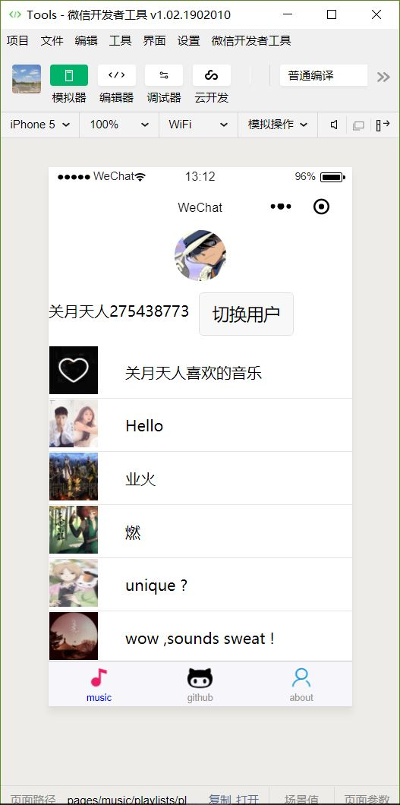
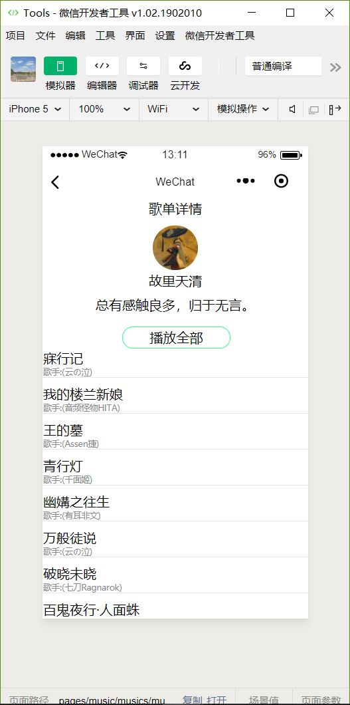
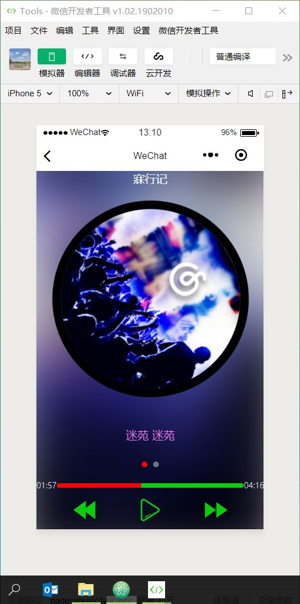
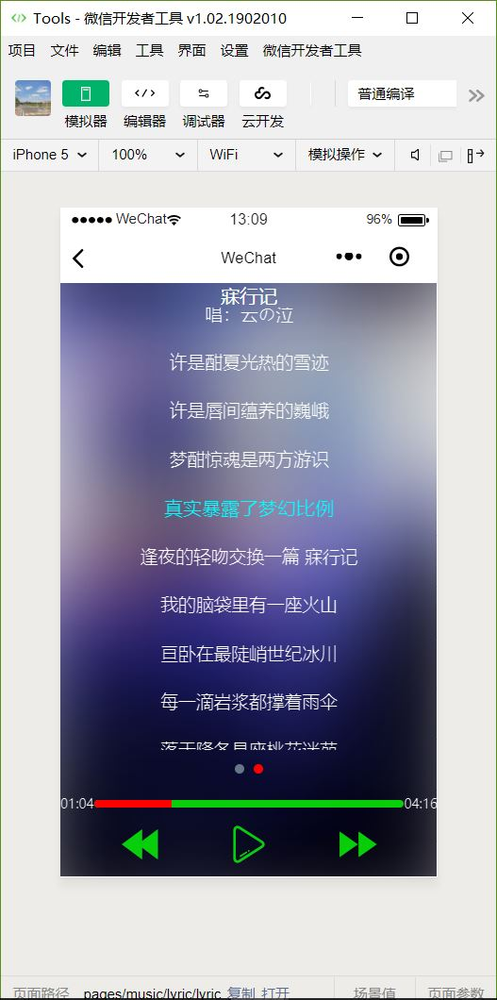

# Test
>music: 获取个人歌单，播放音乐（网易云）   

微信小程序，简单尝试             
 <!--
TODO:OR勾选不校验合法域名、web-view（业务域名）、TLS 版本以及 HTTPS 证书
github: github登陆，个人主页（github.com未经ICP备案，未进行实现）   
me: 测试获取微信个人运动数据，需要个人服务器获取Session，同样ICP备案
-->   

## music
网易云个人歌单获取，播放音乐

### 运行界面

       

